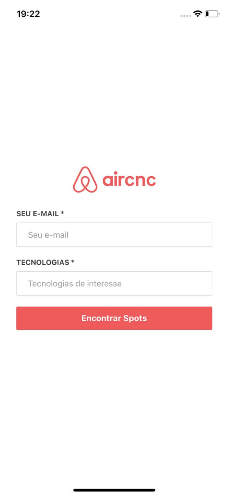
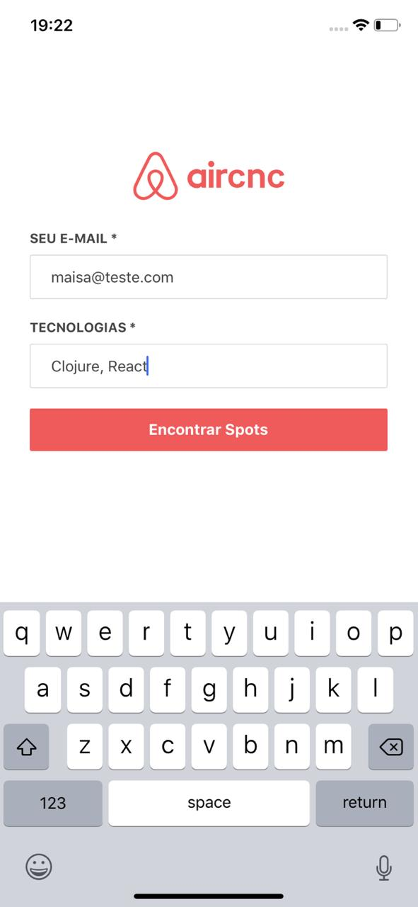
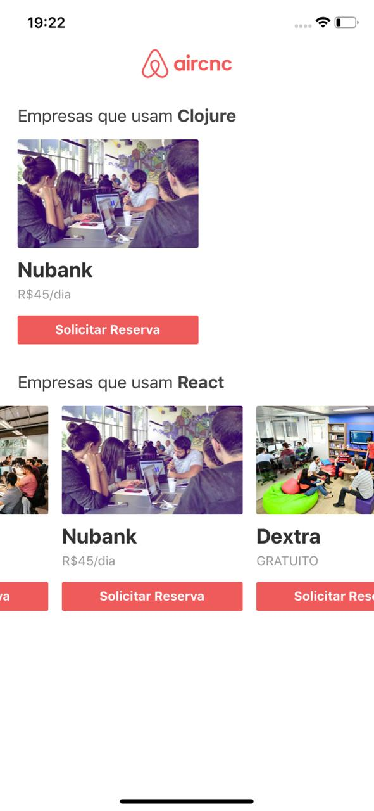
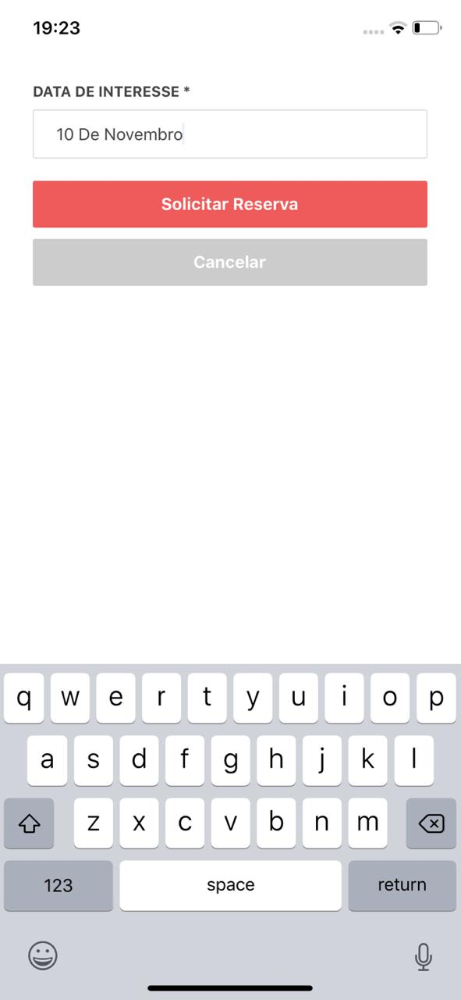
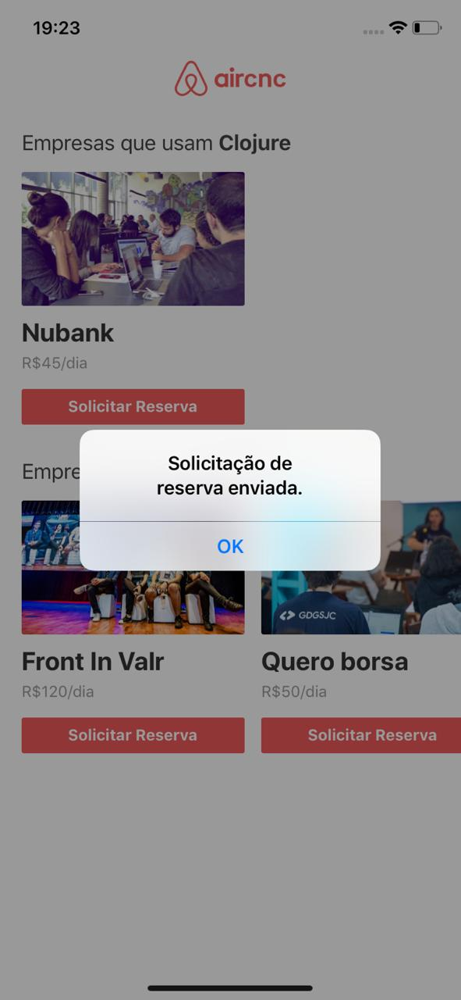

<h1 align="center">Welcome to Aircnc Mobile - Omnistack.09 🚀</h1>
<p>
  
  <a href="https://twitter.com/maisamaximo_" target="_blank">
    
  </a>
</p>
<h2>Mobile Version</h2>
<h3 align="center">
Application that helps people connect to companies that are making the rental of physical places and the whole structure so that they can use and work with affordable values.
</h3>

<h6 align="center">
This project is an application developed in React, React Native and Node.js produced in a course taught by Rocketseat.
<br>
Aircnc is a custom clone that aims to apply the knowledge and technologies used in the market.
<br>
</h6>

<p align="center"><strong>Fun Fact:</strong> <em>the 'c' of aircnc are references to 'code' and 'coffee'.</em>
</p>

<h3 align="center"> First of all, you must run the backend and front end application: <a href="https://github.com/maisamaximo/aircnc_backend">aircnc_backend </a>, <a href="https://github.com/maisamaximo/aircnc_frontend">aircnc_frontend</a> </h3>







## Install

```sh
yarn install
```

## Usage

```sh
yarn start
```

###### Important to know

This application was tested using an iphone XR physical device.

You will need to install the expo client application on your device.

When running the project will be opened in the browser a site with adynamic ip for connection (example: exp: //192.168.3.105: 19000)
You will need to change it in the backend, frontend and mobile project to work and sync with your device.

## Author

🙆 **Maisa Maximo**

* Twitter: [@maisamaximo_](https://twitter.com/maisamaximo_)
* Github: [@maisamaximo](https://github.com/maisamaximo)
* Linkedin [Maisa Maximo](https://www.linkedin.com/in/maisa-maximo-ferreira/)

## Show your support

Give a ⭐️ if this project helped you!
